# README
## Students Enrollment Portal

### PPTs
Here are the images from the PowerPoint presentations:

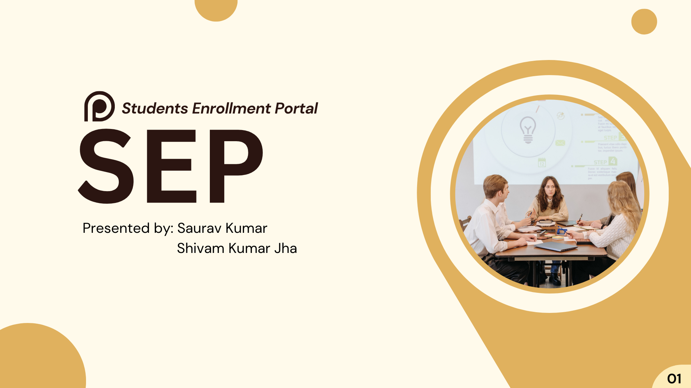
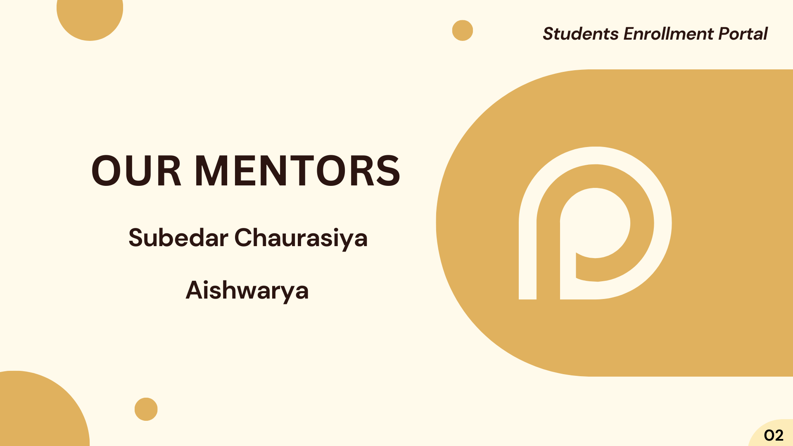
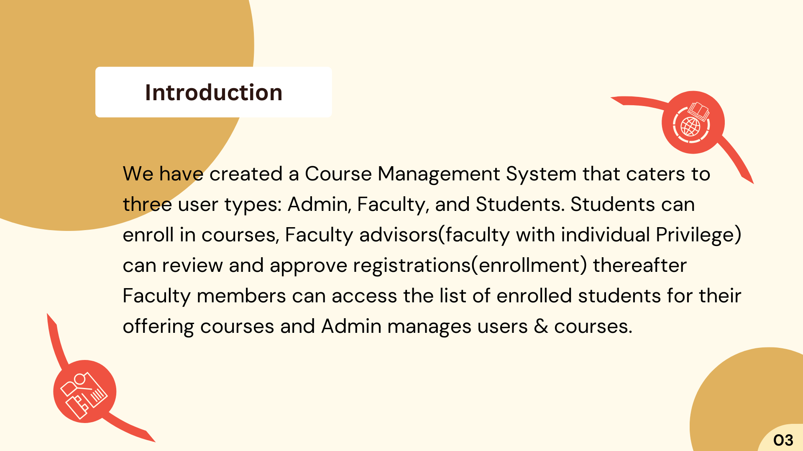
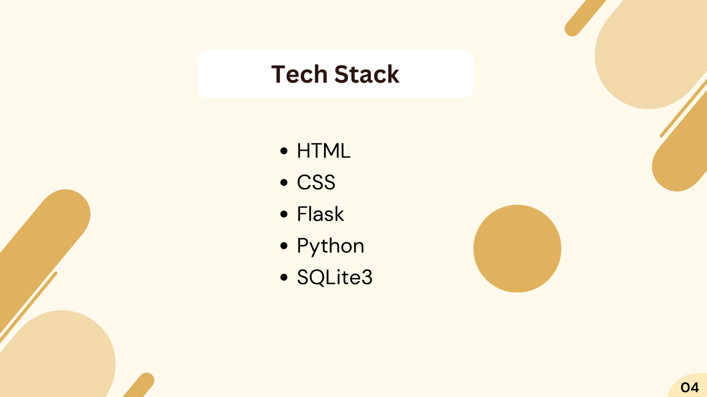
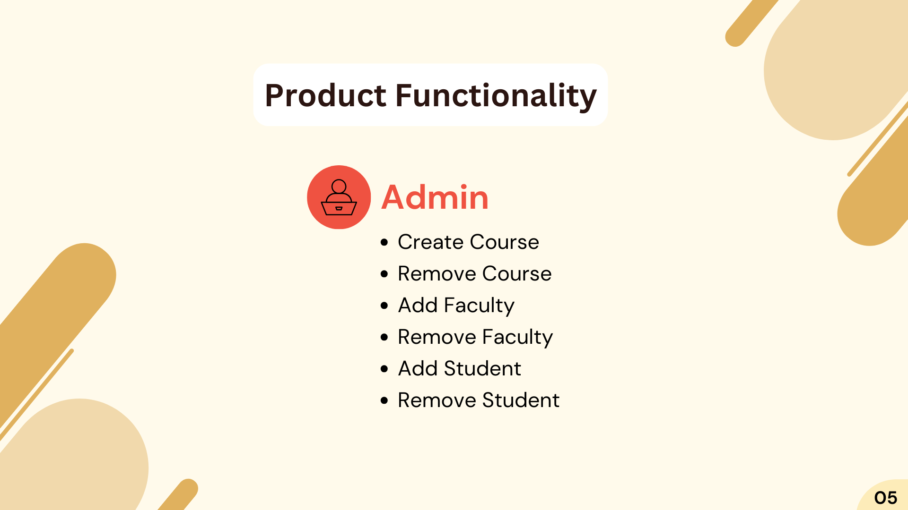
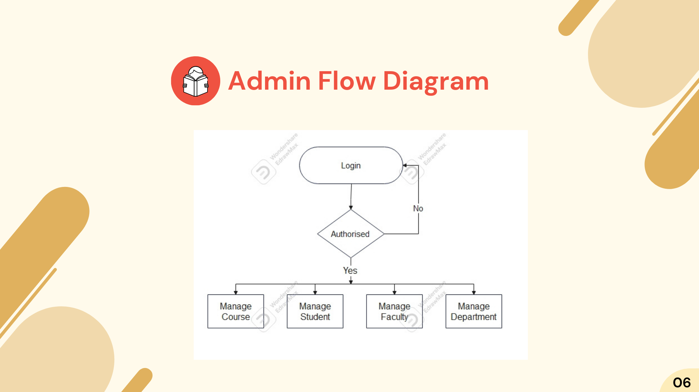
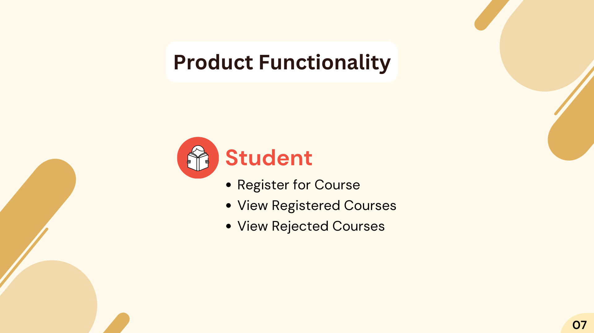
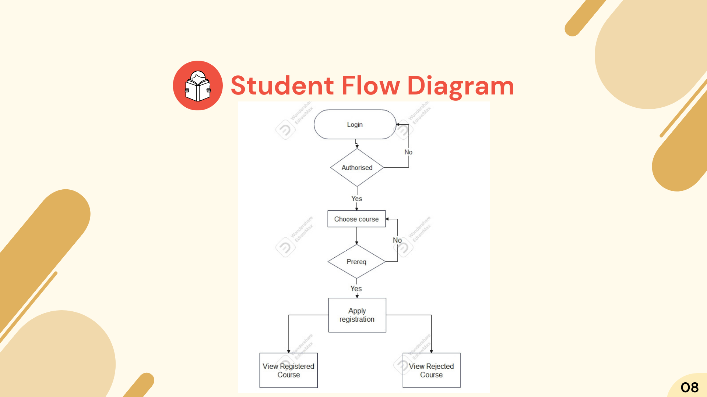
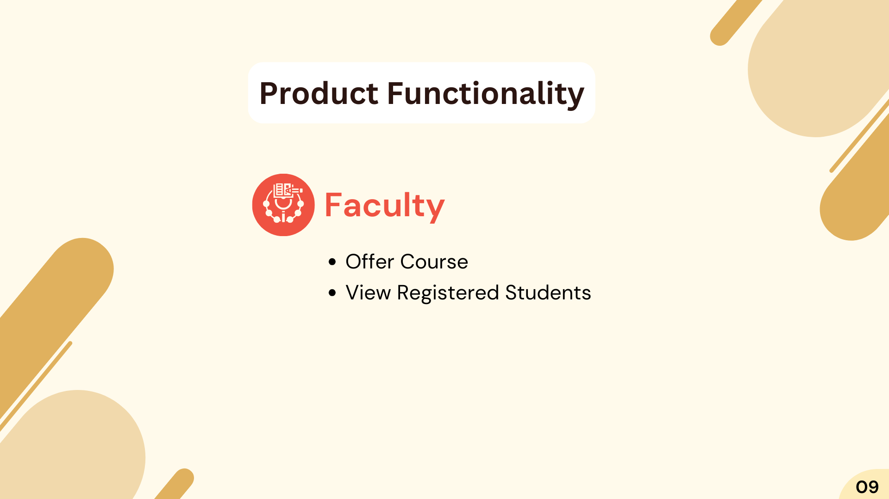
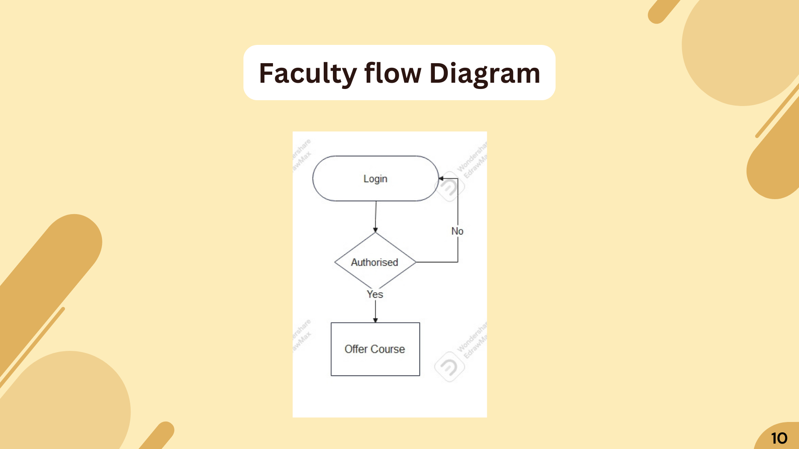
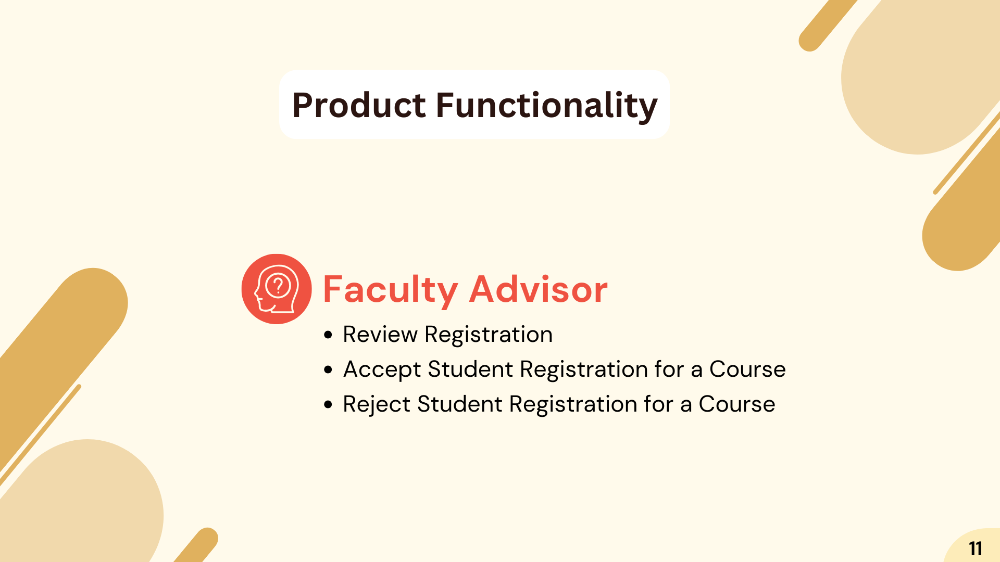
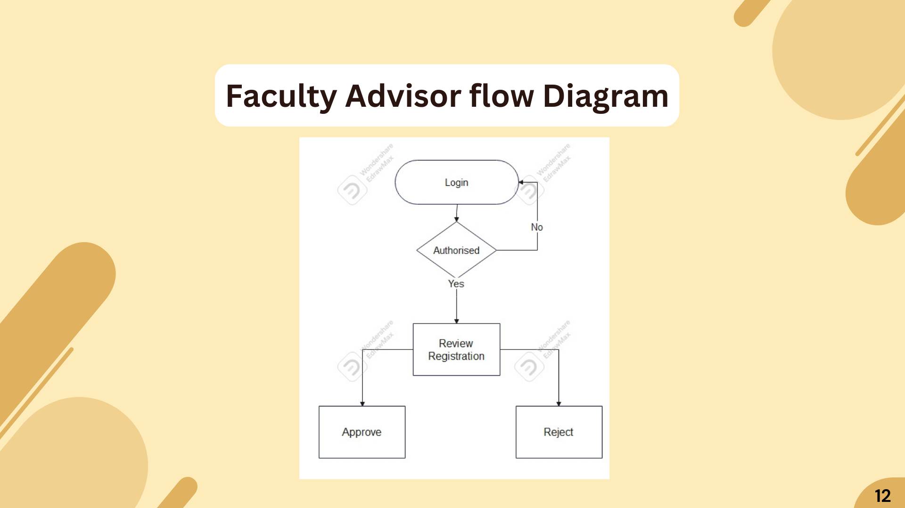
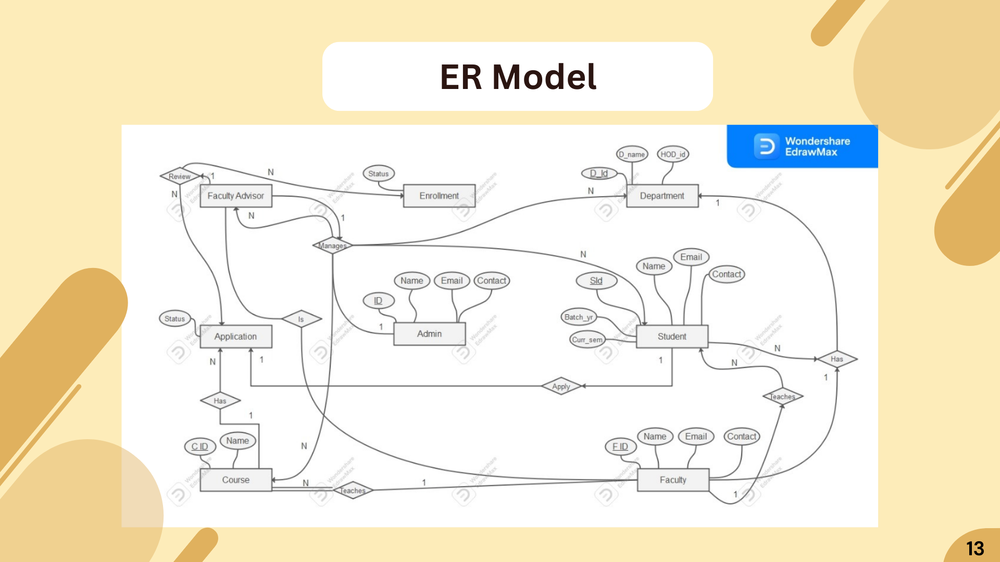
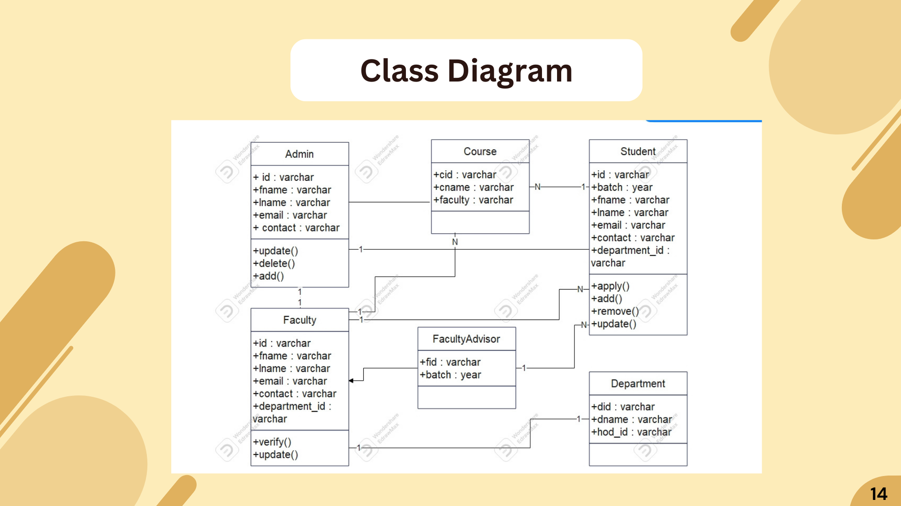
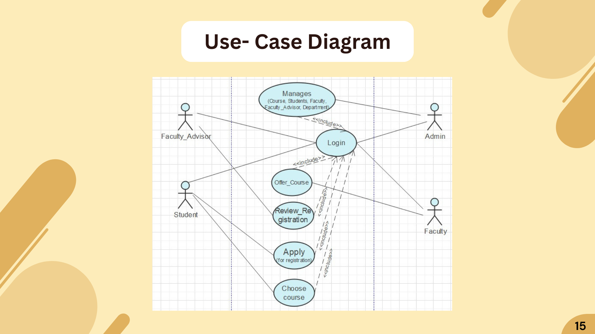
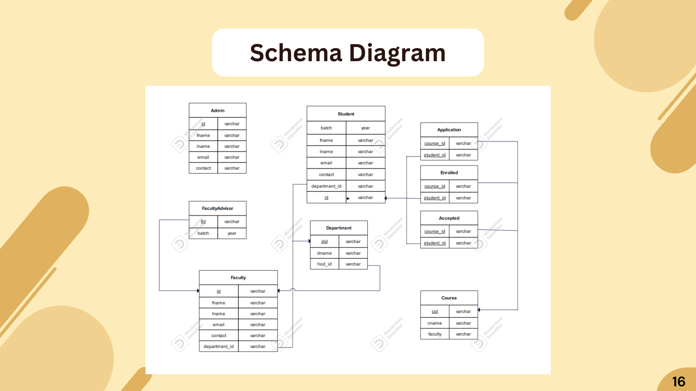

### Get Started

Use the following steps to get the application running:

- Download and Install Python [Download Link](https://www.python.org/downloads/)
- Install Flask. Open terminal and type `pip install flask`.
- Install BCrypt. Open terminal and type `pip install bcrypt`.
- Download or clone the project.
- Open a terminal in the project directory and type `Flask --app main --debug run`
- Open a browser and go to **localhost:5000** to view the app.

(Optional) Install **DB Browser for SQLite** to be able to directly interact with the database [Download Link](https://sqlitebrowser.org/dl/). Navigate to the Project Directory and open the file `Server.db` with DB Browser.
